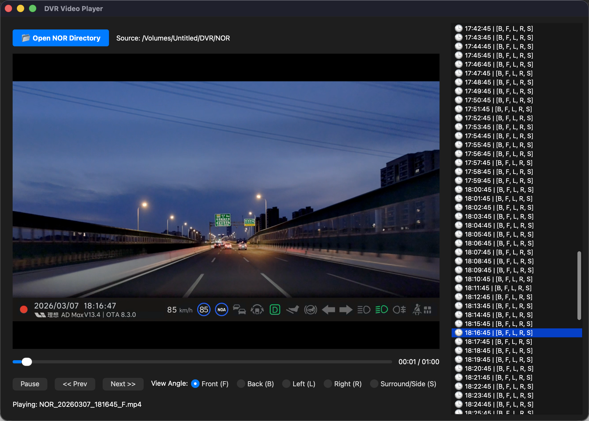

# DVR Video Player

理想汽车行车记录仪多角度视频播放器，基于 PyQt6 构建。

支持读取理想汽车 DVR 导出的 `NOR` 目录，自动按时间戳分组多角度录像，提供连续播放和快速跳转功能。



## 功能

- **多角度同步** — 自动按时间戳分组前（F）、后（B）、左（L）、右（R）、环绕（S）五个角度的录像，切换角度时保持播放进度
- **连续播放** — 当前片段播放结束后自动跳转到下一个时间段
- **时间轴导航** — 侧边栏按日期分组展示所有录像，点击即可跳转
- **智能回退** — 当前方（F）录像缺失时，自动切换到环绕（S）角度

## 支持的文件格式

播放器扫描目录中符合以下命名规则的文件：

```
NOR_YYYYMMDD_HHMMSS_[FBLRS].mp4
```

例如：`NOR_20260307_174045_F.mp4`

## 快速开始

### 环境要求

- Python 3.x

### 安装

```bash
git clone <your-repo-url>
cd dvr-player

python3 -m venv venv
source venv/bin/activate  # Windows: venv\Scripts\activate

pip install -r requirements.txt
```

### 运行

```bash
python3 main.py
```

启动后点击 **Open NOR Directory** 选择行车记录仪导出的 NOR 文件夹即可开始播放。

## 打包为独立应用

使用 PyInstaller 打包为 macOS 应用：

```bash
pip install pyinstaller
pyinstaller --windowed --name="DVR_Player" main.py
```

产物：`dist/DVR_Player.app`

## 项目结构

```
dvr-player/
├── main.py            # GUI 应用主程序（DVRPlayer）
├── dvr_scanner.py     # 文件扫描与分组逻辑（DVRScanner）
└── requirements.txt   # Python 依赖
```

## 许可证

MIT
